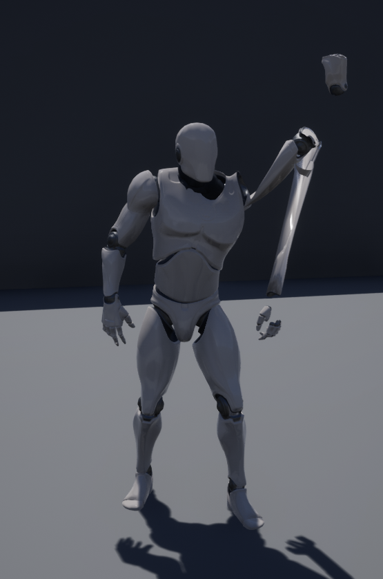

# Control Rig Bug Report

This project demonstrates a problem that I encountered while working with Control Rig in Unreal Engine 4.25.1. 
It is based on the ThirdPersonExample template. The only changes I made are:

1. Added a Control Rig with a single control that is tied to a FABRIK call.
2. Modify the animation blueprint so that the pose passes through this control rig.

The character looks fine in the editor view of the map, with its left hand raised to the sky.
However, open up `ThirdPerson_AnimBP`, and you'll see the arm gone wonky.
You also see this problem if you build the project (for Windows 64-bit, in my case) and run the executable.

If you go back to the control rig, disconnect the control, reconnect the control, compile, and save, 
then when you look at the animation blueprint, it renders properly again. However, this does not change
the behavior of packaging: the packaged project still has the arm rendering problem.